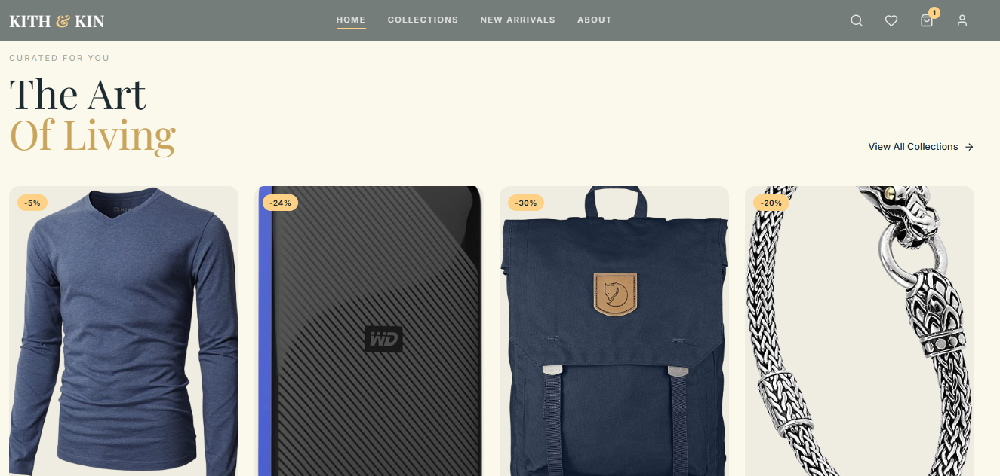
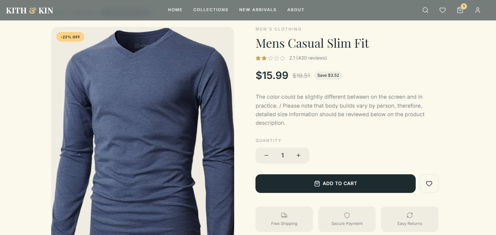
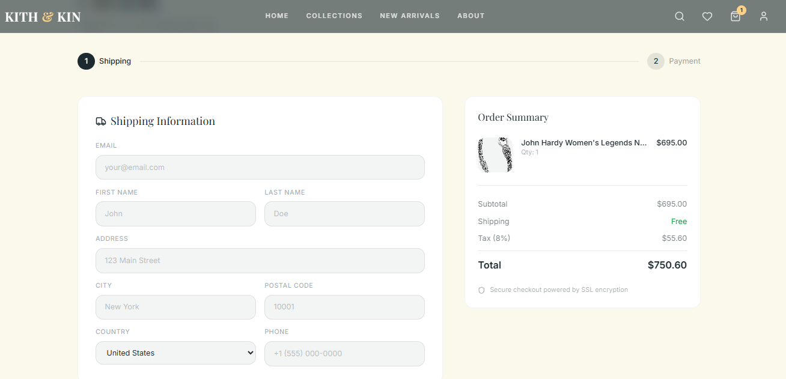
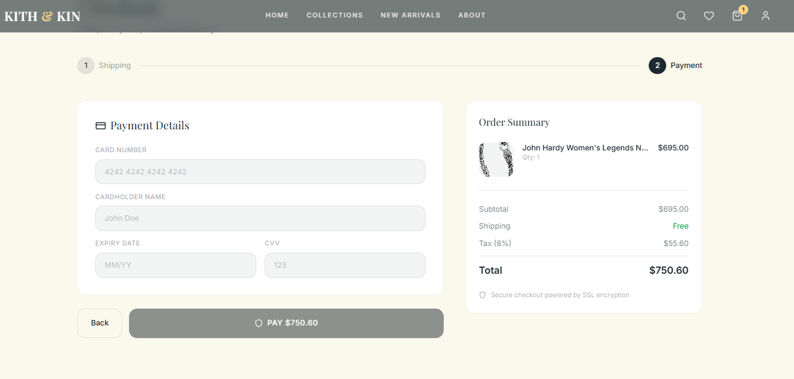
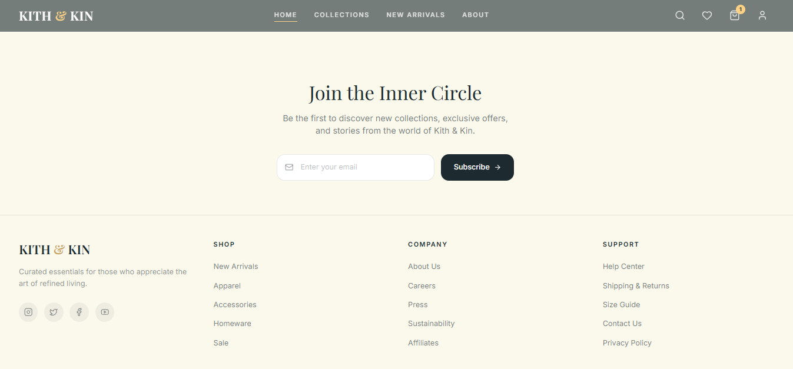

# 🛍️ Kith & Kin – Luxury E-Commerce Web App

A modern, elegant, and fully responsive luxury e-commerce web application built with **React, TypeScript, Vite, and Tailwind CSS**. Designed with a premium UI/UX approach, Kith & Kin delivers a seamless shopping experience with advanced features like cart management, wishlist functionality, product filtering, and smooth animated interactions.

---

# ✨ Live Demo

🔗 https://kith-kin.vercel.app/

---

# 🚀 Tech Stack

- ⚛️ React 19
- 🟦 TypeScript
- ⚡ Vite
- 🎨 Tailwind CSS
- 🧠 Context API (State Management)
- 🔀 React Router DOM
- 📦 Fake Store API

---

# 🧩 Features

## 🖥️ Modern UI / UX

- Glassmorphic responsive navbar with blur effect
- Animated hero section with canvas particle effects
- Smooth hover animations and transitions
- Fully responsive design (Mobile, Tablet & Desktop)

---

## 🛒 E-Commerce Functionality

- Product listing with responsive grid layout
- Product detail page with image gallery
- Add to cart / remove from cart
- Wishlist system
- Multi-step checkout flow
- Order success confirmation page

---

## 🔍 Search & Filtering

- Live product search
- Category-based filtering
- Price range slider
- Rating filter

---

## ⚙️ Performance Optimization

- Lazy image loading
- Debounced search
- Memoized components
- API caching strategy

---

# 📄 Pages Included

- 🏠 Home Page
- 🛍️ Collections / Shop
- 📦 Product Details
- ❤️ Wishlist
- 🛒 Cart Drawer
- 💳 Checkout Flow
- ✅ Payment & Order Success

---

# 🎨 Design System

## Color Palette

| Purpose | Color |
|----------|--------|
| Primary | `#1d2b30` (Deep Teal) |
| Accent | `#fed286` (Luxury Gold) |
| Background | `#fbf8ec` (Warm Cream) |

---

## Typography

- **Playfair Display** → Headings
- **Inter** → UI Text
- **Manrope** → Body Text

---

# 📁 Project Structure

```bash
src/
 ├── components/
 ├── pages/
 ├── context/
 ├── hooks/
 ├── assets/
 ├── routes/
 └── main.tsx
```

---

# 📸 Screenshots

## 🏠 Home Page


---

## 🆕 New Arrival Collection



---

## 📦 Product Details



---

## 🛒 Add To Cart


---

## 💳 Checkout Page



---

## 💰 Payment Page



---

## 👣 Footer Section



---

# ⚙️ Installation & Setup

## Clone the Repository

```bash
git clone https://github.com/your-username/kith-kin.git
cd kith-kin
```

## Install Dependencies

```bash
npm install
```

## Run Development Server

```bash
npm run dev
```

## Build for Production

```bash
npm run build
```

## Preview Production Build

```bash
npm run preview
```
---

# 👩‍💻 Author

**Noor Huda**  
Django Developer • React.js Developer • AI/ML Enthusiast

---
